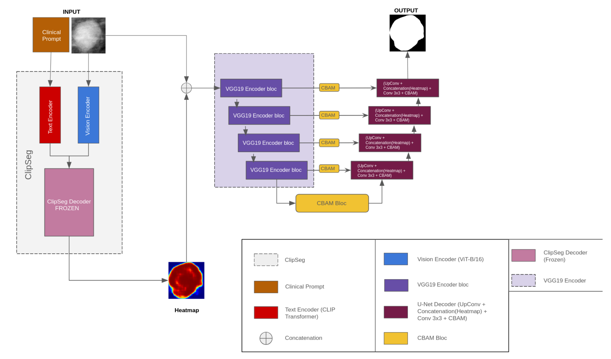

# Multimodal Medical Image Segmentation using Vision-Language Models (VLM)

This repository contains the official implementation of our custom hybrid architecture developed for **automatic breast lesion segmentation** on the **CBIS-DDSM** (Mammography) dataset. 

This project was developed as part of our Computer Science Bachelor's Thesis (PFE) at **USTHB (2026)**.

---

## Architecture Overview
Our final state-of-the-art (SOTA) model, **`VGG19_CLIP_Hybrid_SOTA`**, bridges the gap between raw pixel data and clinical reports by combining a pre-trained semantic expert with a deep convolutional refiner.

### How it works:
1. **Semantic Expert (CLIPSeg):** A frozen Vision-Language Model (VLM) reads the clinical prompt (e.g., *"a malignant mass with spiculated margins"*) and generates a high-level **Semantic Heatmap** of the lesion.
2. **Visual Encoder (VGG19):** Extracts robust local texture and geometric features from the raw image.
3. **Hierarchical Attention (CBAM):** Spatial and Channel attention gates are placed at **every skip connection level** to filter out dense tissue noise.
4. **Morphological Refiner (Deep UNet):** A deep decoder uses double $3\times3$ convolutions to smooth the pixelated CLIPSeg heatmap and precisely **sculpt the fine tumor boundaries (spicules)**.

---

## Architecture Schematic
Place your custom architecture diagram (`architecture_diagram.png`) inside a folder named `figures/` in this repository, and it will render automatically below:



---

## Datasets Used
* **CBIS-DDSM (Mammography):** Curated subset of the Digital Database for Screening Mammography, including raw crops and clinical reports.
* **BUSI (Ultrasound):** Breast Ultrasound Images dataset used for unimodal baseline validation.

---

## Quick Start: How to Run on Kaggle

Since training large Vision-Language models requires significant computational power, we recommend running this project on **Kaggle** (using their free NVIDIA Tesla T4 GPU).

### Step-by-Step Tutorial:
1. **Create a Kaggle Notebook:**
   * Go to [Kaggle](https://www.kaggle.com/) and create a new notebook.
   * In the right panel, select **GPU T4 x2** as the accelerator.
2. **Add the CBIS-DDSM Dataset:**
   * Click on **"Add Input"** on the right panel.
   * Search for the dataset: `cbis-ddsm-breast-cancer-image-dataset` (by awsaf49) and add it to your environment.
3. **Import the Notebook:**
   * Upload our file `presentation(1).ipynb` into your Kaggle session.
4. **Configure & Run:**
   * Make sure the path variables in the first cells match your Kaggle input directory (e.g., `/kaggle/input/...`).
   * Run the cells sequentially from top to bottom. The script will automatically build the `master_dataset.csv`, extract the ClinicalBERT embeddings, and train/validate the hybrid models.

---

## Local Gradio Demo (Radiology Assistant UI)
We developed a local web interface using **Gradio** to allow radiologists to load validation patients, choose any variant (Keras or PyTorch), and visualize the segmentation mask overlaid on the raw scan in real-time.

To launch the local demo, run:
```bash
pip install gradio tensorflow torch torchvision opencv-python transformers
python main_gradio.py
